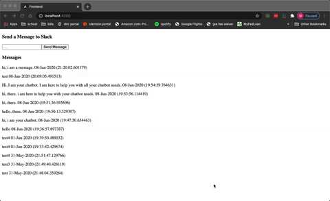

## Chatbot Project

This [Chatbot](https://github.com/mgould1799/chatbot-proj) project showcases a quick project on
Angular, Python Flask, and PostGreSQL DB. The idea is
the frontend takes in a message, sends it to the Flask API,
the API stores it in the database, and finally posts it in Slack.
The frontend keeps a record of the past messages.

